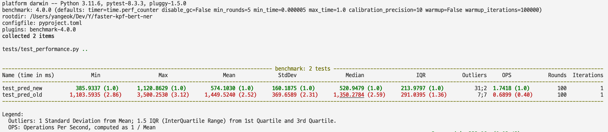

# Faster KPF-BERT-NER

## 저장소 소개

본 저장소는 [BIGKINDS-LAB](https://github.com/KPF-bigkinds/BIGKINDS-LAB/tree/main)을 포크한 저장소입니다. MIT 라이센스를 쓰신 덕에 포크하지 않고 직접 성능을 개선할 수 있음에 감사합니다.

모델 성능은 따로 손대지 않고 로직 수정하여 성능을 개선했습니다.

### 성능 비교표

- 2.86x 개선 (최단 기준)
- 3.12x 개선 (최대 기준)
- 2.52x 개선 (평균 기준)
- 2.31x 개선 (표준편차 기준)
- 2.59x 개선 (중앙값 기준)

| 최소 | 최대 | 평균 | 표준편차 | 중앙값 | OPS | 실행횟수
| --- | --- | --- | --- | --- | --- | ---
| 기존 코드 | 385.9337 | 1,120.8629 | 574.1030 | 160.1875 | 1.7418 | 100
| 신규 코드 | 1103.5935 | 35002530 | 1449.5240 | 369.6589 | 291.0395 | 100



## 모델 소개

### KPF-BERT-NER

한국언론진흥재단이 개발한 kpf-BERT 모델을 기반으로 NER(Named Entity Recognition) task를 수행할 수 있는 kpf-BERT-ner 모델을 설계 및 개발한다. NER은 이름을 가진 객체를 인식하는 것을 의미한다. 한국정보통신기술협회가 제공하는 정보통신용어사전에 따르면 NER은 다음과 같다.
"NER은 미리 정의해둔 사람, 회사, 장소, 시간, 단위 등에 해당하는 단어(개체명)를 문서에서 인식하여 추출 분류하는 기법. 추출된 개체명은 인명(person), 지명(location), 기관명(organization), 시간(time) 등으로 분류된다. 개체명 인식은 정보 추출을 목적으로 시작되어 자연어 처리, 정보 검색 등에 사용된다."
실무적으로 표현하면 ‘문자열을 입력으로 받아 단어별로 해당하는 태그를 출력하게 하는 multi-class 분류 작업’이다. 본 과제에서는 kpf-BERT-ner 모델을 설계 및 개발하고 언론 기사를 학습하여 150개 클래스를 분류한다.

- 본 예제에 사용된 kpf-BERT는 [kpfBERT](https://github.com/KPFBERT/kpfbert)에 공개되어 있다.

- 한국어 데이터 셋은 모두의 말뭉치에서 제공되는 [국립국어원 신문 말뭉치 추출](https://corpus.korean.go.kr/request/reausetMain.do) 를 사용하였다.

한국언론진흥재단이 개발한 kpf-BERT를 기반으로 classification layer를 추가하여 kpf-BERT-ner 모델을 개발한다.
BERT는 대량의 데이터를 사전학습에 사용한다.
kpf-BERT는 신문기사에 특화된 BERT 모델로 언론, 방송 매체에 강인한 모델이다.


BERT 모델의 학습을 위해서는 문장에서 토큰을 추출하는 과정이 필요하다.
이는 kpf-BERT에서 제공하는 토크나이저를 사용한다.
kpf-BERT 토크나이저는 문장을 토큰화해서 전체 문장벡터를 만든다.
이후 문장의 시작과 끝 그 외 몇가지 특수 토큰을 추가한다.
이 과정에서 문장별로 구별하는 세그먼트 토큰, 각 토큰의 위치를 표시하는 포지션 토큰 등을 생성한다.


NER 모델 개발을 위해서는 추가로 토큰이 어떤 클래스를 가졌는지에 대한 정보가 필요하다.
본 과제에서는 토크나이저를 사용하여 문장을 토큰으로 분류한 이후에 해당 토큰별로 NER 태깅을 진행한다.
추가로 BIO(Begin-Inside-Outside) 표기법을 사용하여 정확도를 높인다.
B는 개체명이 시작되는 부분, I는 개체명의 내부 부분, O는 개체명이 아닌 부분으로 구분한다.


---

## 실행하기 위한 환경

## Usage

> **Note**: 기존 저장소의 사용법은 아래와 같이 대체하였습니다. 파인튜닝은 기존 저장소 [BIGKINDS-LAB](https://github.com/KPF-bigkinds/BIGKINDS-LAB/tree/main)를 참고해주세요.

### 패키지 설치

```sh
poetry install
```

### 추론

#### 예제 스크립트

```sh
poetry run python -m ner_module
```

#### 구동

> **Note**: 예제 문자열은 기존 저장소에서 제공하는 예제로 저의 정치적 견해와는 아무런 관계가 없습니다.
  
```py
from ner_module import ner_predict
# `ner_predict_old`가 기존 함수

text = """더불어민주당 이재명 대표가 이른바 '성남FC 후원금 의혹' 사건과 관련해 오는 10일 검찰에 출석해 조사를 받는다. (...)"""

ner_predict(text) # [{'word': '더불어민주당', 'label': 'OGG_POLITICS', 'desc': '정부 행정'}, (...)]
```

#### 테스트

```sh
poetry run task test-perf
```
